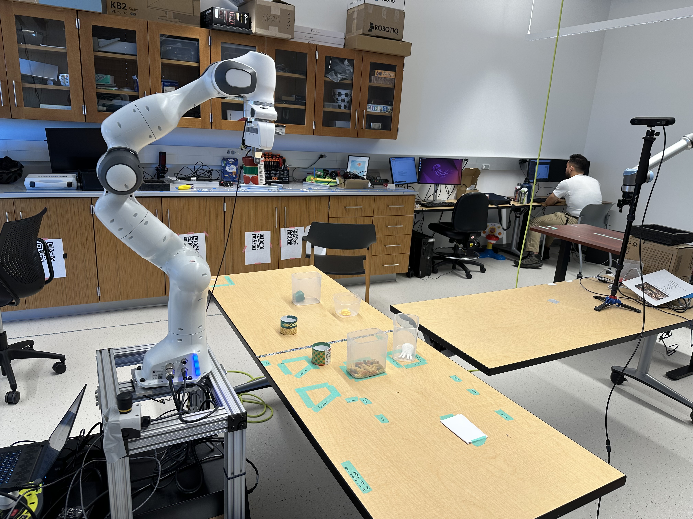
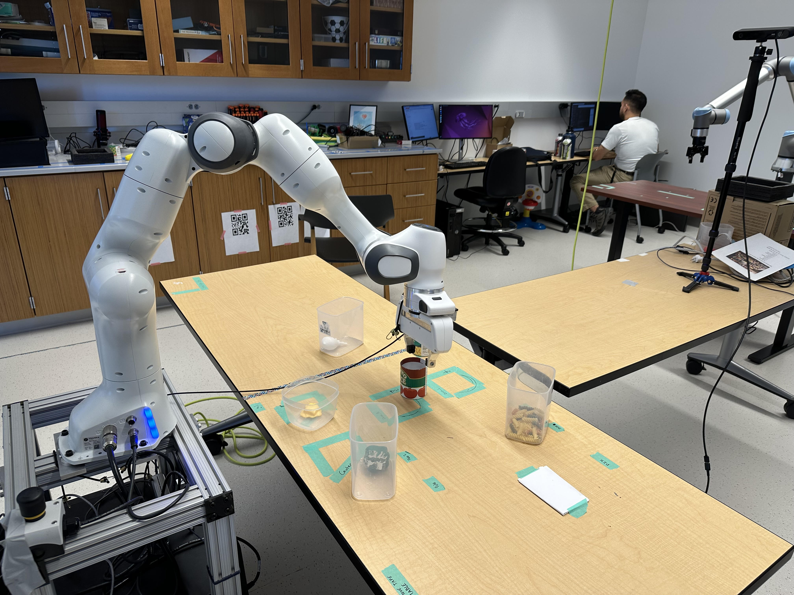
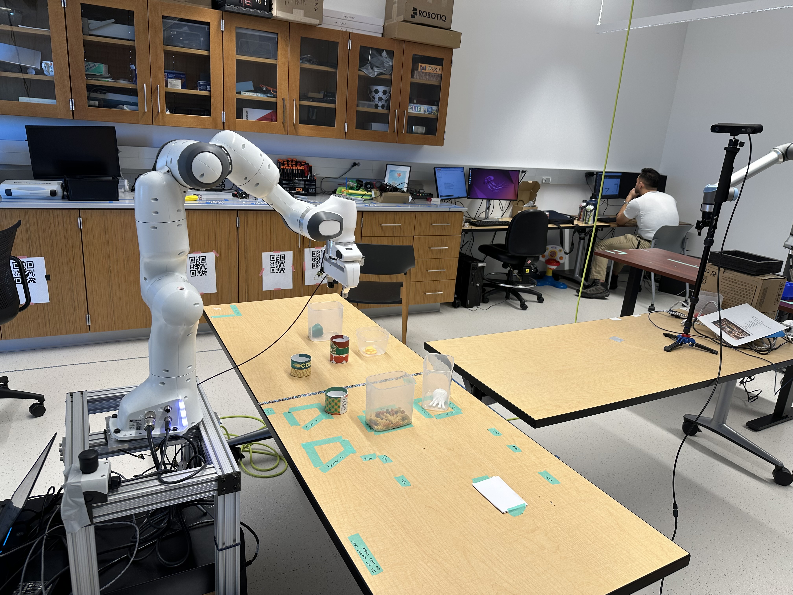
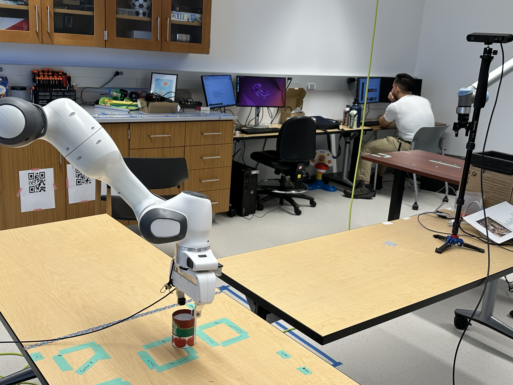

# RLDS Dataset Structure for Franka Panda

Below are the details of the RLDS (Reinforcement Learning Datasets) file structure used to store episode data for the **Franka Panda** robot performing the **mug pick-and-place** task. The environment consists of clutter and varying positions of Toamto sauce the object the we are interesrted to pickup. The dataset adheres to the [RLDS standard](https://github.com/google-research/rlds), ensuring compatibility with OpenVLA.

## **Episode Structure**

Each episode is stored as a dictionary with the following keys:

- **`observations`**: Sensor data captured during the episode.
- **`actions`**: The sequence of actions taken.
- **`rewards`**: The cumulative reward obtained.
- **`success`**: Boolean flag indicating task completion.
- **`task`**: Description of the task.
- **`robot`**: Name of the robot (`Franka Panda`).
- **`camera`**: Type of camera used (`ZED 2i`).
- **`input`**: The initial natural language instruction.
- **`openVLA_compatible`**: Boolean indicating OpenVLA compatibility.

### **Observations**

Each observation consists of:

- **RGB Camera Feed**:$ \mathbb{R}^{H \times W \times 3} $ — Raw RGB image from the **ZED 2i** camera.
- **Depth Map**:$ \mathbb{R}^{H \times W} $ — Depth image.
- **Joint States**:$ \mathbb{R}^{N} $ — Positions, velocities, and torques of **N** robot joints.

```python
episode["observations"] = {
    "rgb": self.rgb_data,         # (H, W, 3) RGB image
    "depth": self.depth_data,     # (H, W) Depth map
    "joint_states": self.joint_states,  # (8,) Joint positions
}
```

### **Actions**

Each action consists of:

- **End-effector Pose Changes**: $ (\Delta x, \Delta y, \Delta z, \Delta \phi, \Delta \theta, \Delta \psi) $$$
- **Gripper State**: $ \{0,1\} $ (0: Close, 1: Open)

$$
a_t = (\Delta x, \Delta y, \Delta z, \Delta \phi, \Delta \theta, \Delta \psi, g)
$$

```python
episode["actions"] = [
    (dx, dy, dz, d_roll, d_pitch, d_yaw, gripper_state),
    ...
]
```

### **Rewards and Success**

- **Initial reward**: `0`
- **Final reward**: `1` if successful, else remains `0`
- **Success Flag**: `True` if the task was completed successfully.

```python
episode["rewards"] = 0  # Initially zero
episode["success"] = False  # Task not yet completed
...
# At the end of the episode
episode["rewards"] = 1  # Task completed
episode["success"] = True
```

## **RLDS File Format**

The dataset is stored as a sequence of episodes in a structured RLDS format. Each episode follows:

$$
\mathcal{E} = (\mathcal{O}, \mathcal{A}, \mathcal{R}, S, T, R, C, I)
$$

where:

-$ \mathcal{O} $ = Observations (RGB, depth, joint states)
-$ \mathcal{A} $ = Actions (End-effector deltas + gripper state)
-$ \mathcal{R} $ = Reward
-$ S $ = Success flag
-$ T $ = Task
-$ R $ = Robot
-$ C $ = Camera
-$ I $ = Input instruction

### **Example JSON Entry**

```json
{
  "observations": {
    "rgb": "...",
    "depth": "...",
    "joint_states": "..."
  },
  "actions": [[-0.01, 0.015, -0.005, 0.0, 0.0, 0.01, 1]],
  "rewards": 1,
  "success": true,
  "task": "mug_pick_and_place",
  "robot": "franka_panda",
  "camera": "zed_2i",
  "input": "Pickup the mug",
  "openVLA_compatible": true
}
```

## Dataset Collection Environment Setup





